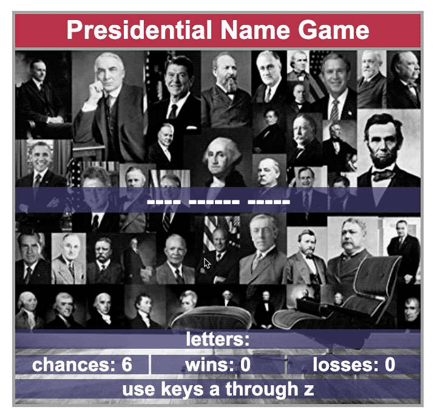

# Project Title

Word Guess Game - Presidential Name Game

## Description

This is an HTML, CSS, javascript hang-man style guessing game using the theme of the 44 US presidents.
The player uses key board to select letters of a hidden name. Correct selection reveal the displayed letter
in the word.  Player losses the word if 6 misses are exhausted.  Instructions and information is displayed in message bar at bottom of page.   Game session continues through all 44 presidents afterwhich the player is presented with option to play again. 

## Deployed Page:
https://mylescarey2019.github.io/Word-Guess-Game/

## Play Example

## Getting Started

### Dependencies

* Supports english keyboard letter set a through z only
* not responsive design, requires viewport of about 680x480 and keyboard

### Installing

* none necessary - use browser to play
* 
### Executing program

* open in browser and follow message bar instructions
*   1. keyboard a through z to select a letter in name
    2. spacebar to advance to next word 
    3. spacebar to start new session after all 44 names solved
    4. word must be solved before 6 misses are exhausted
    

## Help

page display show "chances" left - each word 

##Development Notes

1. teaeta
2. akatj
   1. kldjasg
      1. lakdgaj
      2. 

## Authors

Myles Carey 
mylescarey2019@gmail.com 

## Version History

* 0.1
    * Initial Release

## License

## Acknowledgments

Thanks to beta testers - my 15yo daughter who reminded me
that correct word guesses do not count as misses
